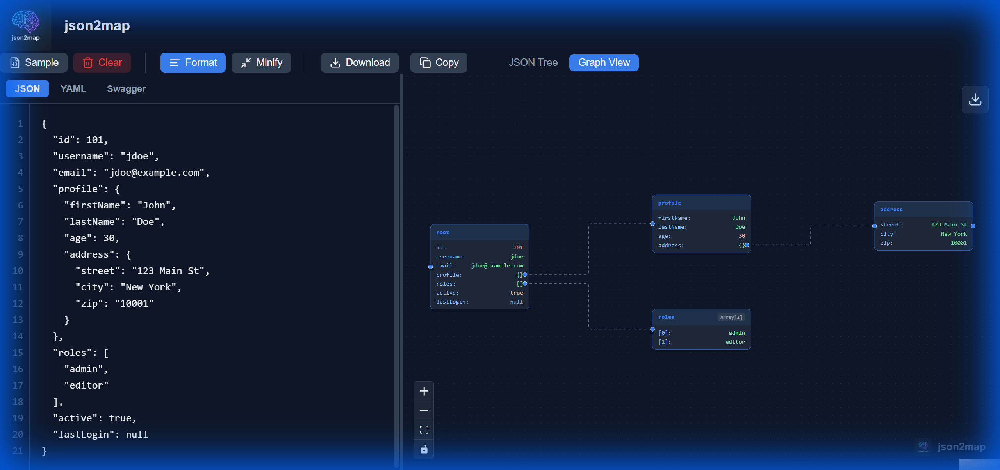
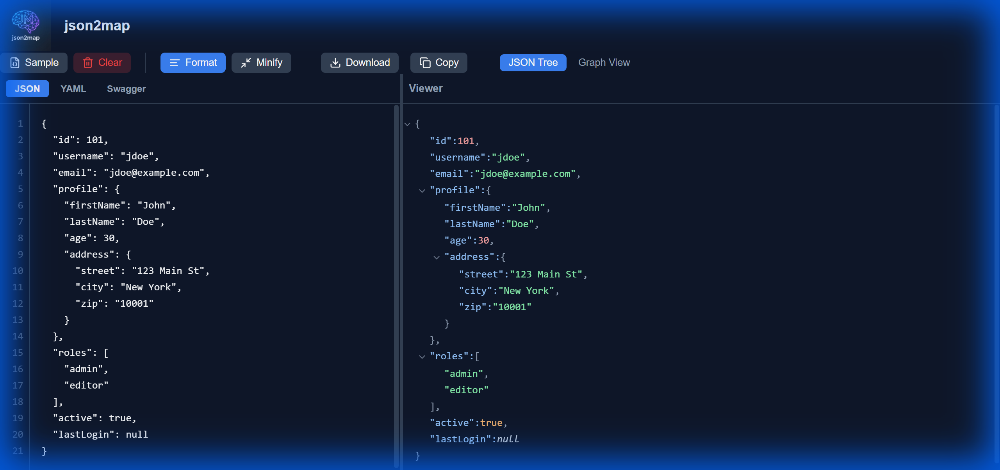

# Visualize Your Data: Introducing json2map

*JSON is the language of the web, but reading raw JSON files can be a nightmare. Enter json2map ; a tool designed to turn your data into beautiful, interactive mind maps.*

As developers, we deal with JSON every day. Whether it's API responses, configuration files, or data dumps, JSON is everywhere. But let's be honest: scrolling through thousands of lines of nested brackets and braces is not the most efficient way to understand the structure of your data.

That's why I built **[json2map.com](https://json2map.com)**.

## The Problem with Raw JSON

JSON is great for machines, but not always for humans. When you're trying to debug an issue or understand a new API, you often find yourself:
- Collapsing and expanding sections in your IDE.
- Losing track of which level of nesting you're in.
- Struggling to see the "big picture" of the data relationships.

## The Solution: Mind Maps

**json2map** takes your JSON data and instantly converts it into an interactive mind map. This visualization allows you to see the hierarchy and relationships of your data at a glance.

### Key Features

- **Instant Visualization**: Just paste your JSON, and the map is generated immediately.
- **Interactive Graph**: Zoom, pan, and drag nodes to explore your data structure.
- **Dual Views**: Switch between the classic Tree View for a structured look and the Graph View for a spatial representation.
- **Privacy Focused**: Your data is processed locally in your browser. It's never sent to a server.

## How It Works

Using json2map is incredibly simple:

1.  **Paste your JSON**: Copy your JSON data and paste it into the editor on the left.
2.  **Explore**: The tool automatically parses your JSON and renders it.
3.  **Switch Views**: Click "Graph View" to see the mind map visualization.

## Why Use json2map?

- **Debugging**: Quickly spot missing fields or incorrect data types.
- **Documentation**: Generate screenshots of your data structure for documentation.
- **Learning**: Help new team members understand complex data schemas faster.

## Try It Out

Ready to see your data in a new light? Head over to **[json2map.com](https://json2map.com)** and give it a try. It's free, fast, and runs entirely in your browser.

Happy coding!
