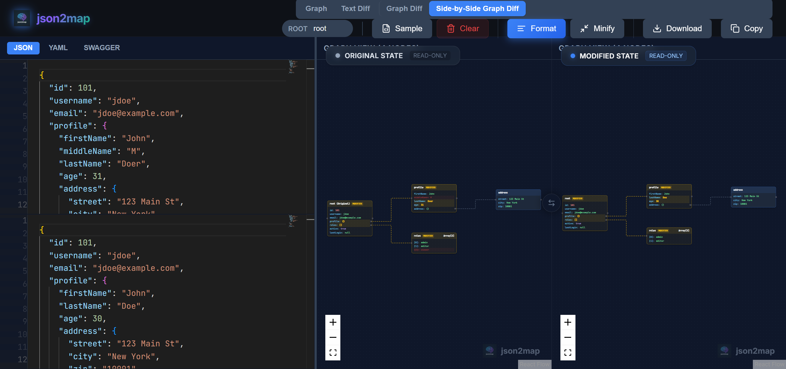
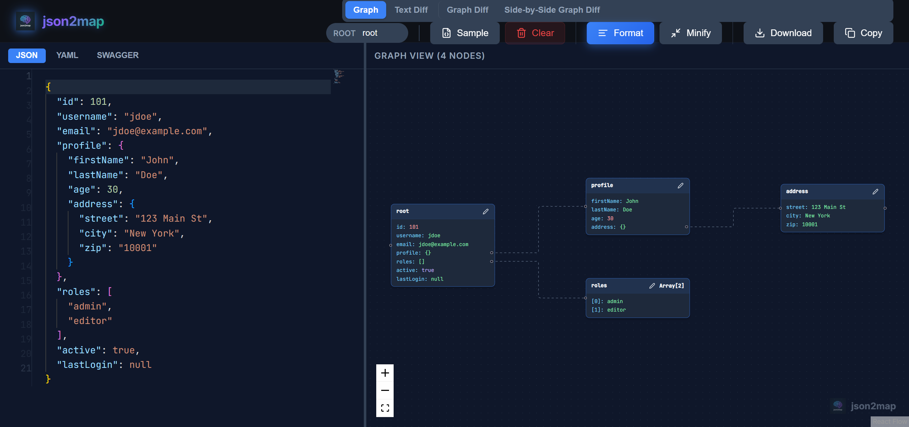

# Visualize Your Data: Introducing json2map

*JSON is the language of the web, but reading raw JSON files can be a nightmare. Enter json2map; a tool designed to turn your data into beautiful, interactive mind maps.*

As developers, we deal with JSON every day. Whether it's API responses, configuration files, or data dumps, JSON is everywhere. But let's be honest: scrolling through thousands of lines of nested brackets and braces is not the most efficient way to understand the structure of your data.

That's why I built **[json2map.com](https://json2map.com)**.

## What's New?

We've listened to your feedback and just released a massive update packed with requested features to make your workflow even smoother.

### Side-by-Side Graph Diff

The most requested feature is finally here! You can now compare two JSON objects side-by-side visually to spot differences instantly.

This is a game-changer for:
- Debugging API changes (v1 vs v2).
- Spotting missing fields in configuration files.
- Visualizing state changes in your application.

### VS Code Style Editor

We've replaced the simple text area with a full-blown **Monaco Editor** (the same editor that powers VS Code).

Enjoy features you love:
- Syntax highlighting
- Code folding
- Auto-formatting
- Validation
- Minification

### High Performance for Big JSONs

We've completely reworked the graph viewer algorithm. It now renders large JSON objects with ease, ensuring smooth panning and zooming even with thousands of nodes.

## The Solution: Mind Maps

**json2map** takes your JSON data and instantly converts it into an interactive mind map. This visualization allows you to see the hierarchy and relationships of your data at a glance.

### Key Features

- **Instant Visualization**: Just paste your JSON, and the map is generated immediately.
- **Interactive Graph**: Zoom, pan, and drag nodes to explore your data structure.
- **Dual Views**: Switch between the classic Tree View and the spatial Graph View.
- **Privacy Focused**: Your data is processed locally in your browser. It's never sent to a server.

## How It Works

Using json2map is incredibly simple:

1.  **Paste your JSON**: Copy your JSON data and paste it into the editor on the left.
2.  **Explore**: The tool automatically parses your JSON and renders it.
3.  **Switch Views**: Click "Graph View" or "Side-by-Side Graph Diff" to see the mind map visualization.

## Why Use json2map?

- **Debugging**: Quickly spot missing fields or incorrect data types.
- **Documentation**: Generate screenshots of your data structure for documentation.
- **Learning**: Help new team members understand complex data schemas faster.

## Try It Out

Ready to see your data in a new light? Head over to **[json2map.com](https://json2map.com)** and give it a try. It's free, fast, and runs entirely in your browser.

Happy coding!
